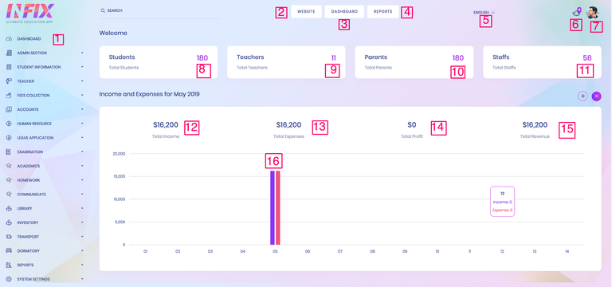
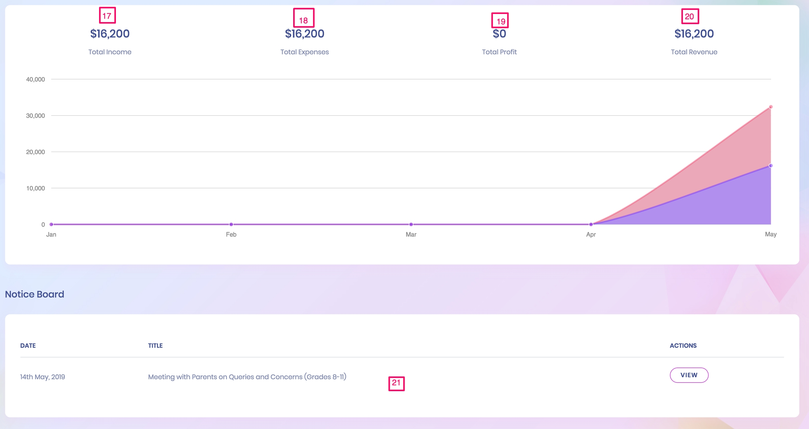
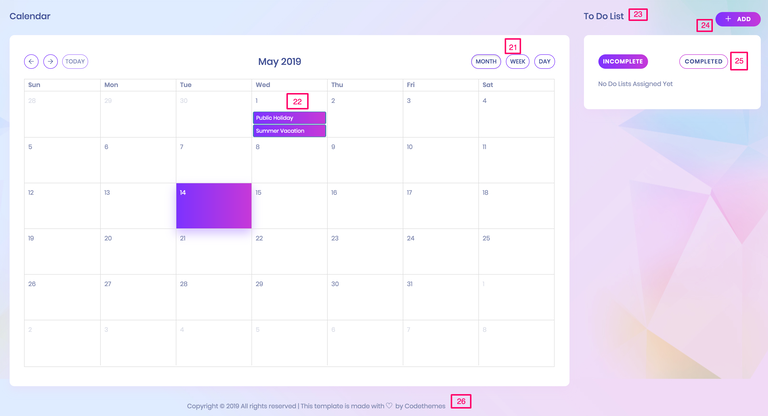

# oimEdu Dashboard

**1 & 3. Dashboard**
At the top menu of the left sidebar is the Dashboard. The dashboard provides an overview of the number of students, teachers, and staff. It also displays a summary of the income and expenses, which is crucial for an ERP system. Upon logging in, users can view updates for the current day.

**2. Website**
Users can easily navigate back to their website's homepage from the dashboard.

**4. Reports**
The Reports section plays a vital role in this School Management ERP. Users can access the report section from any part of the system.

**5. Language**
oim comes equipped with various languages: English, Arabic (RTL), French, Dutch, German, Hindi, Italian, Turkish, Russian, Spanish, and Portuguese. Users can also add their own language customizations.

**6. Notifications**
If administrators or teachers assign tasks to students, notifications are automatically sent to the respective teachers, students (all students or specific class students), and parents. Users can also track sent messages.

**7. Profile**
Users can view and edit their profiles, change their passwords, and log out using the options provided in this section.

**8. Number of Students**
Users can view the total number of students, manage their profiles, change passwords, and log out from this section.

**Dashboard**
At the top of the left sidebar is the Dashboard. It provides a comprehensive view of the number of students, teachers, and staff. Additionally, it highlights the income and expenses summary essential for the ERP system. Users can stay updated with the latest information for the day upon logging in. 